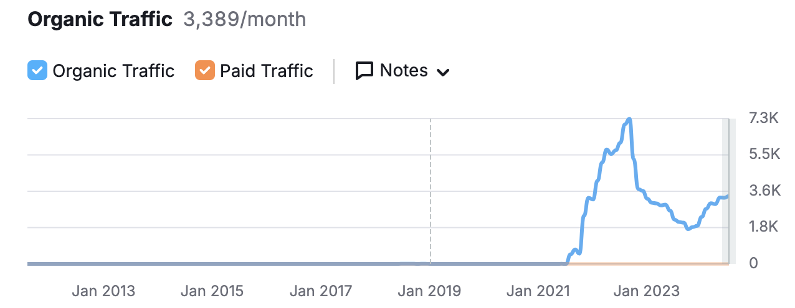

# Timeline

## What is Timeline?

Timeline is a game I stumbled upon in a board game cafe at Toronto.
Eri and I were looking for beginner friendly 2 player games that was fun yet easy to get into.
I actually enjoyed the game a lot since we were able to learn together about world history.
I couldn't find a really good alternative online, so I decided to make it myself.

## Pitfalls of Existing Altneratives

### [Physical Board Game](https://www.ebay.com/itm/335737286445?mkcid=16&mkevt=1&mkrid=711-127632-2357-0&ssspo=_i7EGqk-Qbu&sssrc=2047675&ssuid=&widget_ver=artemis&media=COPY)

The physical board game itself is great, but Eri and I are long distance, so this option is not viable.

### [Wikitrivia](https://wikitrivia.tomjwatson.com/)

Its nice to see that there is some validation that people want to play this game. This website has around 3k monthly users based on [this](https://www.semrush.com/analytics/overview/?q=wikitrivia.tomjwatson.com&searchType=domain) website.


However, the features of this app are extremely limited. It is a 1 player game with no options to change the deck. The UI/UX could also be improved.

### [Kronotrivia](https://kronotrivia.com/)

I really like the website design for this. The UI is well though out. I think the huge killer of this game is their play time restriction. They only give the player one life and one attempt per day.

## Competitive Edge

### Online Multiplayer

The game should be able to function on two different devices. Creating and sharing a lobby should be a painless process.

### Intuitive UI/UX

The game should function as close to the physical game as possible. The look of the cards, and the website design in general should be modeled after a board game cafe.

### Competitive

I really liked the competitive nature of the game. This will embrace that aspect in the form of a points system.

### Unlimited Playtime

The game should not restrict how many times a player can play.

### Modularity

The game should support multiple card packs that can be combined. This adds replayability.

## Business Model

No one likes watching ads. Ads should not be placed everywhere and hinder the player's experience. Instead, it should be placed at the end of the game (scoreboard screen) when value has already been delivered to the user.

Additionally, players can have the option to create an account and buy card packs. Since this is an educational game, there can be card packs dedicated for history classes (APUSH, AP World History, AP European History). This will also remove ads.

If I have time, I want to explore the option of affiliate marketing. Working with creators is a great way to expose your products. Having an affiliate program incentivises creators to promote your product.

## Generating a New Deck

1. Use the prompt below to generate a json file in the format deck_name.json
2. Run the image generation script after editing the deck name

## AI Card Generation

The prompt below is used to generate the data used for the cards.
The ImagePrompt is fed into this [generator](https://deepai.org/machine-learning-model/anime-world-generator) as assets.

```
Topic: World History
Count: 50

Compile a list of historical events based on the above topic. Output the results in JSON format with number of elements equal to the count mentioned above. Each JSON entry should be formatted as below. Only generate events with a definitive date, meaning the date can be attributed to one day. For long lasting events like the World War I, you can create 2 entries for the start and end.

{
id: string // Lowercase unique identifier derived from the title, no numbers allowed
title: string // The name of the historical event
year: number // Formatted like 1453
date: string // Formatted like May 29, 1453
country: string // Location of event
division: string // The Administrative Division of the event (State/Province/Region/Territory)
description: string // A short 1 sentence description about the event.
longDescription: string // A longer 1 paragraph description about the event. Include why the event happened, what happened at the event, how it ended, and the impact of the event.
imagePrompt: string // A prompt used for an image generation model to depict the event.
}
```

## AI Image Generation

All the assets in this project are AI generated since I am lazy and unartistic. The image prompt from above is fed into [deepai](https://deepai.org/machine-learning-model/anime-world-generator).

Created a python script with playwright to automate generating and downloading the images. This way, the entire process to create a new pack can be streamlined.
